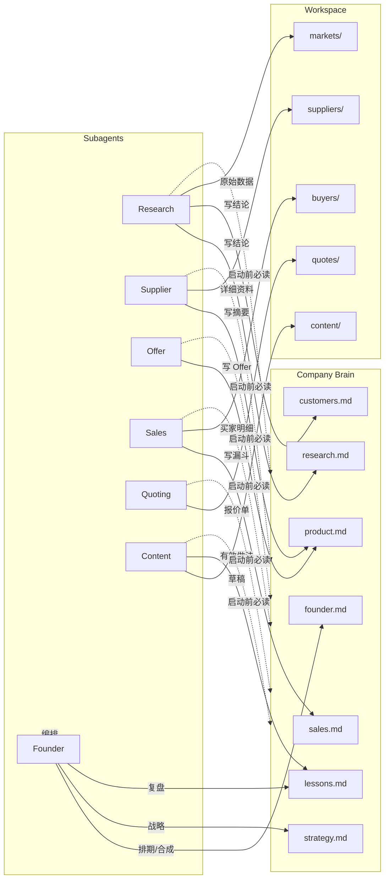

# Workflows — 子代理路由与上下文管理

## 设计原则



---

## 上下文加载顺序（所有子代理统一）

### Step 1 — 必读（每次）

读 `company/` 全部 **8** 个文件（含 `cofounder.md`）。不读不得开始工作。

**默认入口：** 用户未指定子代理时 → **Founder Agent**（`workflows/founder.md`）

### 模型分工（额度节省）

**默认中等；仅点名 `Founder复盘` / `正式Research` 时升高级。** 详见 **[`models.md`](models.md)**。

| 子代理 | 默认 | 高级（点名） |
|--------|------|--------------|
| Founder | `gpt-5.5-medium` | `claude-opus-4-8-thinking-high` ← `Founder复盘` |
| Research | `gpt-5.5-medium` | `grok-4.5-fast-xhigh` ← `正式Research` |
| Supplier | `gpt-5.6-terra-medium` | — |
| Offer / Sales / Content | `gpt-5.5-medium` | — |
| Quoting | `gpt-5.6-terra-medium` | `gpt-5.3-codex` ← `正式报价` |

### Step 2 — 按任务选读

| 子代理 | 额外读取 |
|--------|----------|
| Research | `workspace/markets/keywords.md`, `learn/export-basics.md` |
| Supplier | `workspace/suppliers/*/`, `templates/supplier-inquiry.md` |
| Offer | `learn/export-basics.md` |
| Sales | `workspace/buyers/pipeline.md`, `templates/outreach.md` |
| Quoting | `workspace/suppliers/*/product-summary.md`, `templates/quotation.md` |
| Content | `workspace/content/`, `company/lessons.md` |

### Step 3 — 写回规则

| 写什么 | 写到哪里 | 规则 |
|--------|----------|------|
| 市场结论、选国理由 | `company/research.md` | 只写摘要，≤20 行/周 |
| 目标市场决定 | `company/customers.md` | 必须写明理由 |
| 供应商状态、主推型号 | `company/product.md` | 表格摘要即可 |
| Offer 变更 | `company/product.md` | Offer 是 product 的一部分 |
| 漏斗数字 | `company/sales.md` | 每周日更新 |
| 买家明细 | `workspace/buyers/pipeline.md` | 一行一家公司 |
| 教训 | `company/lessons.md` | 每周 ≥3 条 |
| 正式报价 PDF 草稿 | `workspace/quotes/` | 按买家命名 |

**禁止：** 只在聊天里得出结论却不写回文件。

**SSOT + 单向依赖：** 每条信息只写唯一文档，其余指向它；子代理调用/交接单向无环。硬规定与归属表见根 [`README.md`](../README.md#单向依赖dag硬规定)。

---

## 子代理路由表

| 用户意图 | 子代理 | 默认模型 | 高级（点名） | 工作流 |
|----------|--------|----------|--------------|--------|
| 忘了触发词 | — | — | 说 **`速查`** | [`triggers.md`](triggers.md) |
| 日常排期 / 下一步 | **Founder** | `gpt-5.5-medium` | Opus ← `Founder复盘` | [`founder.md`](founder.md) |
| 轻量调研 / 找关键词 | Research | `gpt-5.5-medium` | Grok ← `正式Research` | [`research.md`](research.md) |
| 核验供应商、询价 | Supplier | `gpt-5.6-terra-medium` | — | [`supplier.md`](supplier.md) |
| 定义 Offer | Offer | `gpt-5.5-medium` | — | [`offer.md`](offer.md) |
| 找买家、写邮件 | Sales | `gpt-5.5-medium` | — | [`sales.md`](sales.md) |
| 做报价单 | Quoting | `gpt-5.6-terra-medium` | Codex ← `正式报价` | [`quoting.md`](quoting.md) |
| 写 LinkedIn 内容 | Content | `gpt-5.5-medium` | — | [`content.md`](content.md) |

---

## 业务流程顺序

> **调用/交接方向必须单向**（DAG，禁止网状/回边）。唯一调用链与硬规定见根 [`README.md` → 单向依赖硬规定](../README.md#单向依赖dag硬规定)。
> 下表是**时间日程**（哪些子代理在该周活跃），不是调用图；下游取上游结果一律**读文档**，不反向调用。

| 周 | 活跃子代理 | 交接方向（单向） |
|----|-----------|------------------|
| Week 1 | Founder → Supplier → Offer | 盘点资源 → 定品类 → 定报价 |
| Week 2 | Research → Sales | 选市场 → 积 50 买家（不发信） |
| Week 3 | Sales | 外联，要回复不要成交 |
| Week 4 | Sales → Quoting → Supplier | 有 Qualified 才向下游交接；Quoting 读 `product.md` 取 FOB |
| Month 2+ | Sales → Quoting → Supplier | 只跟进 Qualified 买家 |

周节奏细节见 [`../plan/`](../plan/)。

---

## 子代理启动模板（复制使用）

```text
【子代理】Founder / Research / Supplier / …（选一个；未指定则 Founder）
【模型】见 workflows/models.md 或上表 model 列

【上下文】请先读取 china-oven-export/company/ 下全部 8 个文件（含 cofounder.md）。
【工作流】读取 workflows/<agent>.md 按其中流程执行。
```

---

## 部门与 GPT 原始设计的对应关系

GPT 的 7 个 `company/` 文件 **就是** 部门的状态存储，不是部门本身：

| GPT 文件 | 部门 | 工作流（怎么做） | 工作区（原始数据） |
|----------|------|------------------|-------------------|
| `founder.md` | **Founder Agent** | `workflows/founder.md` | 合成视图、排期、调度 |
| `cofounder.md` | **人类 Co-founder** | — | 资源、真人动作、待答 |
| `product.md` | 产品 + Offer | `offer.md` + `supplier.md` | `workspace/suppliers/` |
| `customers.md` | 客户 | `workflows/research.md` | `workspace/markets/` |
| `strategy.md` | 战略 | 你本人 + 每周复盘 | — |
| `research.md` | 研究 | `workflows/research.md` | `workspace/markets/` |
| `sales.md` | 销售 | `workflows/sales.md` | `workspace/buyers/` |
| `lessons.md` | 全公司复盘 | 所有子代理结束时 | — |

**我之前多建的 `offer/`、`research/`、`sales/` 文件夹，本质上是把「工作流」和「工作区」误当成了「公司记忆」。现已拆到 `workflows/` 和 `workspace/`。**
